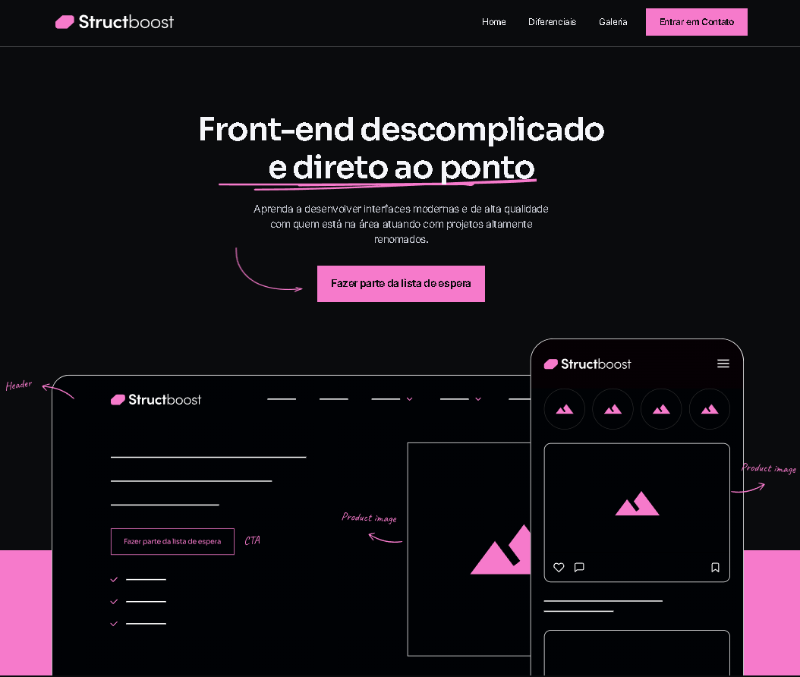

# 🚀 Projeto Structboost

<p align="center">
  
</p>


---

## 📖 Sobre o Projeto

Este projeto foi desenvolvido durante o curso CodeBoost, ministrado pelo professor William Moreira, com o objetivo de consolidar os principais conceitos de desenvolvimento Front-end utilizando HTML5, CSS3 e técnicas de responsividade.

Como primeiro projeto prático do curso, foi possível aplicar conceitos essenciais como Flexbox, CSS Grid, organização de layouts e boas práticas de estilização, resultando em uma landing page moderna, responsiva e de fácil navegação.

Ao longo do desenvolvimento, aprofundei meus conhecimentos na estruturação de projetos, organização do código, reutilização de componentes e criação de interfaces de fácil manutenção, seguindo uma arquitetura limpa e escalável.

---

## ✨ Funcionalidades

- ✅ Interface moderna
- ✅ Layout totalmente responsivo
- ✅ Navegação intuitiva
- ✅ Código organizado
- ✅ Fácil manutenção
- ✅ Compatível com dispositivos móveis

---

## 🛠 Tecnologias Utilizadas

<p align="center">


</p>


## 📂 Estrutura do Projeto

```text
📦 Projeto Structboost
 ┣ 📂 css
 ┣ 📂 imgs
 ┣ 📜 index.html
 ┗ 📜 README.md
```

---


## 🌐 Deploy

O projeto pode ser acessado em:

🔗 <a href="https://gabrielbarcelosd.github.io/Projeto-Structboost/">Structboost</a></p>

---


## 📚 Aprendizados

Este projeto proporcionou uma evolução significativa em diversos aspectos do desenvolvimento Front-end, como:

- Estruturação semântica em HTML;
- Organização e reutilização de componentes;
- Responsividade utilizando CSS;
- Melhores práticas de organização de arquivos;
- Versionamento com Git e GitHub;
- Publicação de aplicações utilizando a Vercel.

---

## 📬 Contato

<div> 
   <a href="mailto:gabrielbarcelosarj@gmail.com">

</a>
  <a href="https://www.linkedin.com/in/gabrielbarcelosofc/" target="_blank"></a>   
  <a href="https://github.com/GabrielBarcelosD">

</a>
</div>


---

<p align="center">
Desenvolvido por <strong>Gabriel Barcelos</strong>
</p>